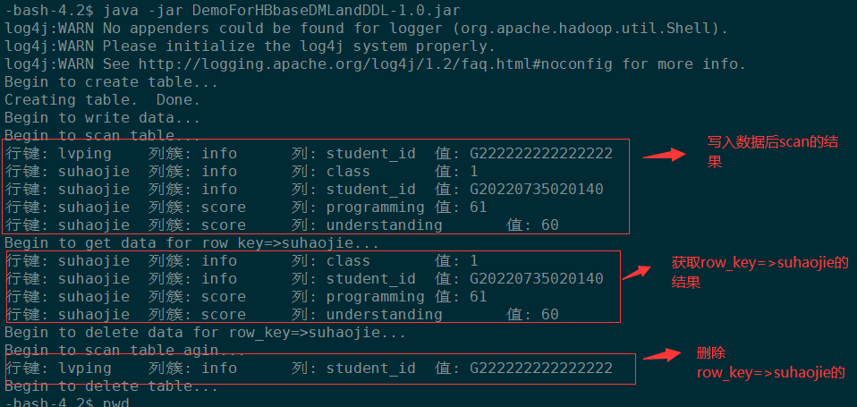

## Homework

### 服务端配置信息

hbase.zookeeper.quorum

emr-worker-2, emr-worker-1, emr-header-1 

zk端口默认2181

### 描述

1. 使用 Java API 操作 HBase

2. 建表，实现插入数据，删除数据，查询等功能。建立一个如下所示的表：

   - 表名：$your_name:student

   - 空白处自行填写, 姓名学号一律填写真实姓名和学号

3. 逻辑视图如下


### 代码逻辑

#### 公共方法

1. JVM加载类资源时初始化环境变量

   ```java
       private static Configuration config;
   
       //获取执行环境
       static{
   
          config = HBaseConfiguration.create();
           //Add any necessary configuration files (hbase-site.xml, core-site.xml)
           config.addResource(new Path(System.getenv("HBASE_CONF_DIR"), "hbase-site.xml"));
           config.addResource(new Path(System.getenv("HADOOP_CONF_DIR"), "core-site.xml"));
       }
   
       public static Configuration getConfig() {
           return config;
       }
   ```

   

2. 创建HBase表

   ```java
       public static void createSchemaTables(String table_name, String[] table_cfs) throws IOException {
           try (Connection connection = ConnectionFactory.createConnection(getConfig())) {
               Admin admin = connection.getAdmin();
               //HTableDescriptor table = new HTableDescriptor(TableName.valueOf(table_name));
               TableDescriptorBuilder tableDescBuilder = TableDescriptorBuilder.newBuilder(TableName.valueOf(table_name));
   
               for(String cf:table_cfs){
                   //table.addFamily(new HColumnDescriptor(cf).setCompressionType(Algorithm.NONE));
                   ColumnFamilyDescriptorBuilder columnDescBuilder = ColumnFamilyDescriptorBuilder
                           .newBuilder(Bytes.toBytes(cf)).setBlocksize(32 * 1024)
                           .setCompressionType(Compression.Algorithm.SNAPPY).setDataBlockEncoding(DataBlockEncoding.NONE);
                   tableDescBuilder.setColumnFamily(columnDescBuilder.build());
   
               }
               System.out.print("Creating table. ");
               if(admin.tableExists(TableName.valueOf(table_name))){
                   System.out.print("Table is existing now ... Deleting");
                   admin.disableTable(TableName.valueOf(table_name));
                   admin.deleteTable(TableName.valueOf(table_name));
                   System.out.print(" Deleted.");
               }
   
               admin.createTable(tableDescBuilder.build());
               //createOrOverwrite(admin, table);
               System.out.println(" Done.");
           }
       }
   ```

   

3. 写入数据

   ```java
       public static void writeValuesToTable(String table_name, String row_key, String cf, String column, String value) throws IOException{
           try(Connection connection = ConnectionFactory.createConnection(getConfig())){
               Table table = connection.getTable(TableName.valueOf(table_name));
               Put put = new Put(Bytes.toBytes(row_key));
               put.addColumn(Bytes.toBytes(cf), Bytes.toBytes(column), Bytes.toBytes(value));
               table.put(put);
           }
       }
   ```

   

4. 扫描全表数据

   ```java
       public static void scanTable(String table_name) throws IOException{
           try (Connection connection = ConnectionFactory.createConnection(getConfig());){
               Table table = connection.getTable(TableName.valueOf(table_name));
               Scan scan = new Scan();
               ResultScanner resultScanner = table.getScanner(scan);
               for(Result result : resultScanner){
                   Cell[] cells = result.rawCells();
                   print(cells);
               }
           }
       }
   ```

5. 按row_key查询数据

   ```java
       public static void getDataByRowKey(String table_name, String row_key) throws IOException{
           try(Connection connection = ConnectionFactory.createConnection(getConfig());){
               Table table = connection.getTable(TableName.valueOf(table_name));
               Get get = new Get(Bytes.toBytes(row_key));
               Result result = table.get(get);
               Cell[] cells = result.rawCells();
               print(cells);
           }
       }
   ```

6. 按row_key删除数据

   ```java
       public static void deleteRowsData(String table_name,String row_key) throws IOException{
           try (Connection connection = ConnectionFactory.createConnection(config);){
               Table table = connection.getTable(TableName.valueOf(table_name));
               List<Delete> deleteList = new ArrayList<>();
               Delete delete = new Delete(Bytes.toBytes(row_key));
               deleteList.add(delete);
               table.delete(deleteList);
           }
   
       }
   ```

   

7. 删除表

   ```java
       public static void deleteTable(String tablename) throws IOException {
           try (Connection connection = ConnectionFactory.createConnection(getConfig())) {
               Admin admin = connection.getAdmin();
               TableName table = TableName.valueOf(tablename);
               admin.disableTable(table);
               admin.deleteTable(table);
           }
   
       }
   ```

#### main方法

```java
        //1.建表并添加列族
        System.out.println("Begin to create table...");
        String table_name = "suhaojie:student";
        String[] table_cfs = new String[]{"info", "score"};
        createSchemaTables(table_name, table_cfs);

        //3. 写入数据
        System.out.println("Begin to write data...");
        String[][] info = new String[6][4];
        info[0][0] = "suhaojie";  info[0][1] = "info";        info[0][2] = "student_id";       info[0][3] = "G20220735020140";
        info[1][0] = "suhaojie";  info[1][1] = "info";        info[1][2] = "class";            info[1][3] = "1";
        info[2][0] = "suhaojie";  info[2][1] = "score";       info[2][2] = "understanding";    info[2][3] = "60";
        info[3][0] = "suhaojie";  info[3][1] = "score";       info[3][2] = "programming";      info[3][3] = "61";
        info[4][0] = "lvping";    info[4][1] = "info";        info[4][2] = "student_id";       info[4][3] = "G111111111111111";
        info[5][0] = "lvping";    info[5][1] = "info";        info[5][2] = "student_id";       info[5][3] = "G222222222222222";
        for(String[] item:info){
            writeValuesToTable(table_name, item[0], item[1], item[2], item[3]);
        }

        //4. 查询所有数据
        System.out.println("Begin to scan table...");
        scanTable(table_name);
        //5. 查询row_key -> suhaojie 的数据
        System.out.println("Begin to get data for row_key=>suhaojie...");
        getDataByRowKey(table_name,"suhaojie");
        //6. 删除 rowkey -> suhaojie 的数据
        System.out.println("Begin to delete data for row_key=>suhaojie...");
        deleteRowsData(table_name, "suhaojie");
        //7. 再次查询所有数据
        System.out.println("Begin to scan table agin...");
        scanTable(table_name);
        //8. 删除表
        System.out.println("Begin to delete table...");
        deleteTable(table_name);
```


### 执行结果

1. 执行命令如下：

   ```shell
   cd /home/student1/suhaojie/lib
   java -jar DemoForHBbaseDMLandDDL-1.0.jar
   ```

2. 日志中输出信息

   

   

3. 代码最终会执行删除”row_key=>suhaojie“数据的操作，在hbase shell中检查确实删除了数据

   