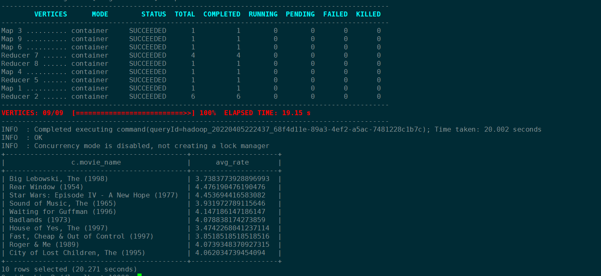

## Homework

### 1. 建表

```sql
use suhaojie;
/************** 观众表**********************/
create external table t_user
( user_id     BIGINT   comment '用户 id'
, sex         CHAR(1)  comment '性别'
, age         TINYINT  comment '年龄'
, occupation  TINYINT  comment '职业'
, zipcode     CHAR(5)  comment '邮编')
ROW FORMAT SERDE 'org.apache.hadoop.hive.contrib.serde2.MultiDelimitSerDe'
WITH SERDEPROPERTIES ("field.delim"="::")
stored as textfile
LOCATION '/home/student1/suhaojie/hive/users';
/************** 电影表**********************/
create external table t_movie
(movie_id     int                 comment '电影 ID'
,movie_name   varchar(1024)       comment '电影名'
,movie_type   string              comment '电影类型')
ROW FORMAT SERDE 'org.apache.hadoop.hive.contrib.serde2.MultiDelimitSerDe'
WITH SERDEPROPERTIES ("field.delim"="::")
stored as textfile
LOCATION '/home/student1/suhaojie/hive/movies';
/************** 影评表**********************/
create external table t_rating
(user_id    bigint    comment '用户 ID'
,movie_id   int       comment '电影 ID'
,rate      TINYINT   comment '评分'
,times     int        comment '评分时间'
)
ROW FORMAT SERDE 'org.apache.hadoop.hive.contrib.serde2.MultiDelimitSerDe'
WITH SERDEPROPERTIES ("field.delim"="::")
stored as textfile
LOCATION '/home/student1/suhaojie/hive/ratings';
```

### 2. 题目

#### 2.1 展示电影 ID 为 2116 这部电影各年龄段的平均影评分

sql

```sql
select b.age, avg(a.rate) as avg_rate
from t_rating a 
join t_user b on a.user_id = b.user_id
where a.movie_id = 2116
group by b.age
order by b.age;
```

运行结果


#### 2.2 找出男性评分最高且评分次数超过 50 次的 10 部电影，展示电影名，平均影评分和评分次数

sql

```sql
select 'M' as sex, b.movie_name, a.avg_rate, a.rate_cnt from
(select a.movie_id, avg(a.rate) as avg_rate, count(1) as rate_cnt
from t_rating a
join t_user b on a.user_id = b.user_id  /*t_rating表和t_user的关联会采用map side join的方式*/
where b.sex = 'M' 
GROUP BY a.movie_id
having count(1)>50) a
join t_movie b on a.movie_id = b.movie_id
order by avg_rate desc 
limit 10;
```

运行结果


#### 2.3 找出影评次数最多的女士所给出最高分的 10 部电影的平均影评分，展示电影名和平均影评分（可使用多行 SQL）

sql

```sql
select c.movie_name,avg(b.rate) as avg_rate from
(select * from t_rating a where exists
 (  /**影评次数最多的女士，且该女士的最高分电影超过了10部**/
    select 1 from 
     (select a.user_id, count(1) as rate_cnt 
       from t_rating a
       join t_user b on a.user_id = b.user_id
       where b.sex = 'F' 
       group by a.user_id) b
       where a.user_id = b.user_id
      order by rate_cnt desc  limit 1
 )
order by a.rate desc limit 10 ) a
join t_rating b on a.movie_id = b.movie_id
join t_movie c on b.movie_id = c.movie_id
group by c.movie_name;
```

运行结果



说明：影评次数最多的女士，且该女士的最高分电影超过了10部，所以评分最高的10部是在最高分的基础上随机选取的。