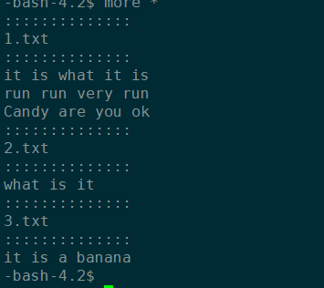
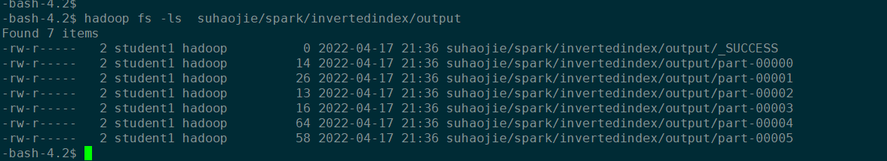
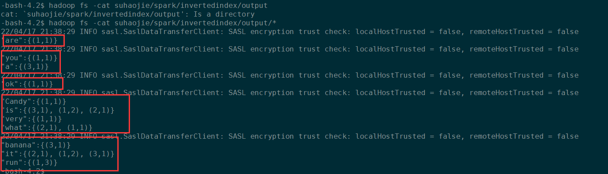
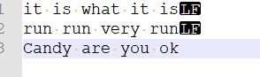
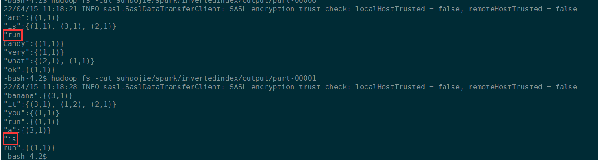

## Homework

### Demo 1:InvertedIndexDemo

#### 项目描述

倒排索引（Inverted index），也被称为反向索引。它是文档检索系统中最常用的数据结构。被广泛地应用于全文搜索引擎。使用 RDD API 实现带词频的倒排索引。

例子如下，被索引的文件为（0，1，2 代表文件名）

> 1. “it is what it is”
> 2. “what is it”
> 3. “it is a banana”
>    我们就能得到下面的反向文件索引：
>    “a”: {2}
>    “banana”: {2}
>    “is”: {0, 1, 2}
>    “it”: {0, 1, 2}
>    “what”: {0, 1}
>    再加上词频为：
>    “a”: {(2,1)}
>    “banana”: {(2,1)}
>    “is”: {(0,2), (1,1), (2,1)}
>    “it”: {(0,2), (1,1), (2,1)}
>    “what”: {(0,1), (1,1)}`


#### 工程准备

- 开发语言：scala

- scala 开发包

  ```xml
  <dependency>
    <groupId>org.scala-lang</groupId>
    <artifactId>scala-library</artifactId>
    <version>${scala.version}</version>
  </dependency>
  ```

- spark 环境

  ```xml
  <dependency>
    <groupId>org.apache.spark</groupId>
    <artifactId>spark-core_2.13</artifactId>
    <version>${spark.version}</version>
  </dependency>
  ```

- hdfs 环境

  ```xml
  <dependency>
    <groupId>org.apache.hadoop</groupId>
    <artifactId>hadoop-client</artifactId>
    <version>${hdfs.version}</version>
  </dependency>
  ```

#### 执行方式

```shell
## 执行模板
spark-submit --class [MainClass] \
--master yarn \
--deploy-mode cluster /home/student1/suhaojie/lib/InvertedIndexDemo-1.0.jar [inputDir] [outputDir]

[MainClass] —— 为执行的主类，有 com.suhj.MainForTextFile、com.suhj.MainForWholeTextFiles 可选
[inputDir]——为用户的输入目录
[outputDir]——为用户的输出目录

##example 1  MainForTextFile 执行方式
spark-submit --class com.suhj.MainForTextFile \
--master yarn \
--deploy-mode cluster /home/student1/suhaojie/lib/InvertedIndexDemo-1.0.jar  suhaojie/spark/invertedindex/input suhaojie/spark/invertedindex/output

##example 1  MainForWholeTextFiles 执行方式
spark-submit --class com.suhj.MainForWholeTextFiles \
--master yarn \
--deploy-mode cluster /home/student1/suhaojie/lib/InvertedIndexDemo-1.0.jar  suhaojie/spark/invertedindex/input  suhaojie/spark/invertedindex/output
```


#### 核心代码

- MainForTextFile.scala

  > 通过轮询每一个文件读取RDD中，并将所有RDD合并成一个 target RDD，对 target RDD 做 reduceByKey 操作，最终将数据格式化输出

  ```scala
  package com.suhj
  
  import org.apache.hadoop.conf.Configuration
  import org.apache.hadoop.fs.{FileSystem, Path}
  import org.apache.spark.rdd.RDD
  import org.apache.spark.{SparkConf, SparkContext}
  
  import scala.collection.mutable.ListBuffer
  
  /**
   * @ClassName MainForTextFile
   * @Author Haojie
   * @create 2022/4/15 13:12
   * 返回的RDD是所有行的集合，一个文件可能分散在多个partition，适合处理有大文件的场景
   */
  object MainForTextFile {
  
    def main(args: Array[String]): Unit = {
  
  
      val appName = "InvertedIndex-suhj"
      // Only one SparkContext should be running in this JVM (see SPARK-2243)
      val conf = new SparkConf().setAppName(appName)
      val sc = new SparkContext(conf)
  
      //解析参数 -- 输入路径，目标路径
      val inputDir = args(0)
      val outputDir = args(1)
  
      var target:RDD[(String, String)] = sc.emptyRDD
  
      //获取整个目录下的文件列表
      val file_list = getHDFSFiles(inputDir)
      for(file <- file_list) {
  
        //根据绝对路径+文件名，解析出文件名（不带后缀）
        val file_name = file.split("/").last.split("\\.")(0)
  
        val rdd = sc.textFile("%s/%s".format(inputDir, file))
          .flatMap(line => line.split(" "))
          .map(x => ((x, file_name), 1))
          .reduceByKey(_+_)
          .map(x => (x._1._1, (x._1._2, x._2)))
          .map(x => (x._1, x._2.toString))
  
        target = rdd.union(target)
      }
  
      target.reduceByKey(_+", "+_)
        .map(x =>  "\"%s\":{%s}".format(x._1, x._2))
        .saveAsTextFile(outputDir)
  
    }
  
    /**
     * 给定hdfs目录返回目录下文件名的集合
     * @param hdfsDirectory
     * @return Array[String]
     *  文件名 不带路径？
     */
    def getHDFSFiles(hdfsDirectory:String): Array[String] ={
      val configuration:Configuration = new Configuration()
      //    configuration.set("fs.defaultFS", hdfsFileName)
      val fileSystem:FileSystem = FileSystem.get(configuration)
      val fsPath: Path = new Path(hdfsDirectory)
      val iterator = fileSystem.listFiles(fsPath, true)
      val list = new ListBuffer[String]
      while (iterator.hasNext) {
        val pathStatus = iterator.next()
        val hdfsPath = pathStatus.getPath
        val fileName = hdfsPath.getName
        list += fileName // list.append(fileName)
      }
      fileSystem.close()
      list.toArray
    }
  
  
  }
  ```

- MainForWholeTextFiles.scala

  >  * 适用于有大量小文件的场景
  >  * 用 wholeTextFiles 接口接收的数据，其返回是 <key, value> 二元组，
  >  * key 是文件名，value 是整个文件的内容

  ```scala
  package com.suhj
  
  import org.apache.spark.SparkContext
  import org.apache.spark.SparkConf
  
  
  /**
   * 适用于有大量小文件的场景
   * 用 wholeTextFiles 接口接收的数据，其返回是 <key, value> 二元组，
   * key 是文件名，value 是整个文件的内容
   */
  object MainForWholeTextFiles {
  
    def main(args: Array[String]): Unit = {
  
      //执行参数可以通过配置文件获取
      val appName = "InvertedIndex-suhj"
      val conf = new SparkConf().setAppName(appName)
      val sc = new SparkContext(conf)
  
      //解析参数
      val source_root_dir = args(0)
      val target_root_dir = args(1)
  
      sc.wholeTextFiles(source_root_dir)   //读取目录下的文件
        .map(x => (x._2.replace("\n"," "), x._1.split("/").last.split("\\.")(0)))
        .flatMap(x => x._1.split(" ").map(y =>( (y , x._2), 1))).reduceByKey(_+_)
        .map(x => (x._1._1, (x._1._2, x._2) ))
        .map(x => (x._1, x._2.toString)).reduceByKey(_+", "+_)
        .map(x => "\"%s\":{%s}".format(x._1, x._2))
        .saveAsTextFile(target_root_dir)
  
    }
  
  }
  ```

#### 测试结果

##### 输出数据如下



##### 输出数据如下

输出6个小文件



输出结果如下



#### Spark-shell上交互式测试

> 这个是项目开始前面之前，在spark-shell 进行的测试

##### 倒排索引的构建——wholeTextFiles 方式

- 代码

  版本1

  ```scala
  //1.0 读取处理目录下的所有文件，生成原始RDD
  scala> val inputDir = "suhaojie/spark/invertedindex"
  inputDir: String = suhaojie/spark/invertedindex
  
  scala> val rdd = sc.wholeTextFiles(inputDir)
  rdd: org.apache.spark.rdd.RDD[(String, String)] = suhaojie/spark/invertedindex MapPartitionsRDD[8] at wholeTextFiles at <console>:24
  
  scala> val list = rdd.collect()
  list: Array[(String, String)] = Array((hdfs://emr-header-1.cluster-285604:9000/user/student1/suhaojie/spark/invertedindex/1.txt,it is what it is), (hdfs://emr-header-1.cluster-285604:9000/user/student1/suhaojie/spark/invertedindex/2.txt,what is it), (hdfs://emr-header-1.cluster-285604:9000/user/student1/suhaojie/spark/invertedindex/3.txt,it is a banana))
  
  //2.0 解析路径后的二元组                                       
  scala> val list1 = rdd.map(x => (x._1.split("/").last.split("\\.")(0), x._2)).collect()
  list1: Array[(String, String)] = Array((1,it is what it is), (2,what is it), (3,it is a banana))
                             
                                         
  //3.0 用rdd2来表示解析路径后的产生的RRD
  scala> val rdd2 = rdd.map(x => (x._1.split("/").last.split("\\.")(0), x._2))
  rdd2: org.apache.spark.rdd.RDD[(String, String)] = MapPartitionsRDD[29] at map at <console>:23
  
  scala> val list2 = rdd.map(x => (x._1.split("/").last.split("\\.")(0), x._2)).collect()
  list2: Array[(String, String)] = Array((1,it is what it is), (2,what is it), (3,it is a banana))
                                         
  //3.1 这里修正一下，将内容作为二元组的第一元，倒排索引作为二元组的第二元
                                         
  scala>  val rdd2 = rdd.map(x => (x._2, x._1.split("/").last.split("\\.")(0)))                                       
                                         
  scala>  val list2 = rdd.map(x => (x._2, x._1.split("/").last.split("\\.")(0))).collect()
  rdd2: Array[(String, String)] = Array((it is what it is,1), (what is it,2), (it is a banana,3))
                                     
                                         
  //4.0 对rdd2 的第一元做一个wordcount
  val wordcount = rdd2.map(x => x._1.split(" ").map(y =>(y , 1))).collect()
                                         
  rdd2.flatMap(x => x._1.split(" ").map(y =>( (y , x._2), 1))).reduceByKey(_+_).map(x => (x._1._1, (x._1._2, x._2) )).groupByKey().map(x => (x._1,x._2)).collect()
                                         
  res21: Array[(String, Iterable[(String, Int)])] = Array((is,CompactBuffer((2,1), (1,2), (3,1))), (what,CompactBuffer((1,1), (2,1))), (banana,CompactBuffer((3,1))), (it,CompactBuffer((3,1), (1,2), (2,1))), (a,CompactBuffer((3,1))))
  
  //5.0 转换成 (w单词,(文件名1,词频1), (文件名2,词频2)) 的格式                                        
  scala> val rdd3 = rdd2.flatMap(x => x._1.split(" ").map(y =>( (y , x._2), 1))).reduceByKey(_+_).map(x => (x._1._1, (x._1._2, x._2) )).map(x => (x._1, x._2.toString)).reduceByKey(_+", "+_)
  scala> rdd3.collect()                                       
  res27: Array[(String, String)] = Array((is,(2,1)(1,2)(3,1)), (what,(1,1)(2,1)), (banana,(3,1)), (it,(3,1)(1,2)(2,1)), (a,(3,1)))
                                         
  //6.0 格式化输出
  rdd3.map(x => "\"%s\":{%s}".format(x._1, x._2)).saveAsTextFile("student1/suhaojie/spark/invertedindex/result")
                                         
  ```

  版本2（整理版）

  > 用 wholeTextFiles 接口进行数据源的读取，该接口会返回 <key , value> 的类型，key 代表文件名，value 代码文件中的内容
  >
  > 该接口适合处理大量小文件的场景
  >
  > 一条记录就是一个文件的内容，那么一个文件必然会加载进一个 JVM 中，即一个文件存在于一个RDD partition 中，一个 JVM 能否处理完一个文件取决于计算机的性能，以及 JVM 的设置
  >
  > 综上，该接口只适合处理大量小文件的场景

  ```scala
  //1.0 读取处理目录下的所有文件，生成原始RDD
  scala> val inputDir = "suhaojie/spark/invertedindex/input"
  inputDir: String = suhaojie/spark/invertedindex
  
  scala> val rdd = sc.wholeTextFiles(inputDir)
  rdd: org.apache.spark.rdd.RDD[(String, String)] = suhaojie/spark/invertedindex MapPartitionsRDD[8] at wholeTextFiles at <console>:24
  //如果数据源无数据，执行 collect 会报错
  
  //2.0 解析文件名，生成 (文本内容,文件名) 的二元组 数组
  //    这里的文本内容会将换行符替换为空格
                                         
  scala>  val rdd2 = rdd.map(x => (x._2.replace("\n"," "), x._1.split("/").last.split("\\.")(0)))
  
  //3.0 以(单词, 文件名) 为 key，进行分组统计 ，转换成 (单词,(文件名1,词频1), (文件名2,词频2)) 的格式  
  scala> val rdd3 = rdd2.flatMap(x => x._1.split(" ").map(y =>( (y , x._2), 1))).reduceByKey(_+_).map(x => (x._1._1, (x._1._2, x._2) )).map(x => (x._1, x._2.toString)).reduceByKey(_+", "+_)
  
  //4.0 格式化输出到hdfs
  //注意：此方式无法生成指定文件名，传参会作为一个路径名，无此路径会自动创建，会在路径下生成如下文件
  //     文件目录已存在的情况下，会报错；需要预处理目标目录
  
  //-rw-r-----   2 student1 hadoop          0 2022-04-15 10:29 student1/suhaojie/spark/invertedindex/result/_SUCCESS
  //-rw-r-----   2 student1 hadoop         49 2022-04-15 10:29 student1/suhaojie/spark/invertedindex/result/part-00000
  //-rw-r-----   2 student1 hadoop         56 2022-04-15 10:29 student1/suhaojie/spark/invertedindex/result/part-00001
  
  rdd3.map(x => "\"%s\":{%s}".format(x._1, x._2)).saveAsTextFile("suhaojie/spark/invertedindex/output")
  ```

- 如何从带绝对路径的文件名中抽取文件名，文件名不带后缀

  ```scala
  scala> val str = "hdfs://emr-header-1.cluster-285604:9000/user/student1/suhaojie/spark/invertedindex/1.txt"
  str: String = hdfs://emr-header-1.cluster-285604:9000/user/student1/suhaojie/spark/invertedindex/1.txt
  
  scala> val strs =str.split("/")
  strs: Array[String] = Array(hdfs:, "", emr-header-1.cluster-285604:9000, user, student1, suhaojie, spark, invertedindex, 1.txt)
  
  scala> strs.length
  res10: Int = 9
  
  scala> strs(8)
  res11: String = 1.txt
  
  scala> strs(8).split("\\.")
  res16: Array[String] = Array(1, txt)
  
  scala> strs(8).split("\\.")(0)
  res17: String = 1
  
  //如下是一步到位的操作
  scala> val file_name = "hdfs://emr-header-1.cluster-285604:9000/user/student1/suhaojie/spark/invertedindex/1.txt".split("/").last.split("\\.")(0)
  file_name: String = 1
  
  
  ```


- 当用 wholeTextFiles  读取整个文本，文本中有多行，有出现统计丢失的情况

    

  

  原因是 wholeTextFiles 会将整个文本读取，包括换行符，解决方式是将换行符替换为空格

  ```scala
  //1.0 读取文本
  scala> val inputDir = "suhaojie/spark/invertedindex/input/1.txt"
  inputDir: String = suhaojie/spark/invertedindex/input/1.txt
  
  scala> val rdd = sc.wholeTextFiles(inputDir)
  rdd: org.apache.spark.rdd.RDD[(String, String)] = suhaojie/spark/invertedindex/input/1.txt MapPartitionsRDD[104] at wholeTextFiles at <console>:24
  
  scala> val rdd2 = rdd.map(x => (x._2, x._1.split("/").last.split("\\.")(0)))
  rdd2: org.apache.spark.rdd.RDD[(String, String)] = MapPartitionsRDD[105] at map at <console>:23
  
  scala> rdd2.collect()
  res45: Array[(String, String)] =
  Array((it is what it is
  run run very run
  Candy are you ok,1))
  //2.0 将文本中的换行符替换为空格
  scala> val rdd2 = rdd.map(x => (x._2, x._1.split("/").last.split("\\.")(0))).collect()
  rdd2: Array[(String, String)] =
  Array((it is what it is
  run run very run
  Candy are you ok,1))
  
  scala> val rdd2 = rdd.map(x => (x._2.replace("",""), x._1.split("/").last.split("\\.")(0))).collect()
  rdd2: Array[(String, String)] =
  Array((it is what it is
  run run very run
  Candy are you ok,1))
  
  scala> val rdd2 = rdd.map(x => (x._2.replace("\n"," "), x._1.split("/").last.split("\\.")(0))).collect()
  rdd2: Array[(String, String)] = Array((it is what it is run run very run Candy are you ok,1))
  ```

##### 倒排索引的构建——textFile 方式

- 代码

  ```scala
  //1.0 读取一个文件，获得目标rdd
  scala> val rdd = sc.textFile("suhaojie/spark/invertedindex/input/1.txt")
  rdd: org.apache.spark.rdd.RDD[String] = suhaojie/spark/invertedindex/input/1.txt MapPartitionsRDD[154] at textFile at <console>:23
  scala> rdd.collect()
  res59: Array[String] = Array(it is what it is, run run very run, Candy are you ok)
  scala> val rdd2 = rdd.flatMap(line => line.split(" "))
  scala>
  rdd2: org.apache.spark.rdd.RDD[String] = MapPartitionsRDD[157] at flatMap at <console>:23
  
  scala> rdd2.collect()
  res62: Array[String] = Array(it, is, what, it, is, run, run, very, run, Candy, are, you, ok)
  
  scala> val rdd3 = rdd2.map(x => ((x, "file_name"), 1)).reduceByKey(_+_).map(x => (x._1._1, (x._1._2, x._2))).map(x => (x._1, x._2.toString))
  rdd3: org.apache.spark.rdd.RDD[(String, String)] = MapPartitionsRDD[200] at map at <console>:23
  
  //1.1 以下是将 rdd 的获取简化为一步操作
  scala> val rdd1 = sc.textFile("suhaojie/spark/invertedindex/input/1.txt").flatMap(line => line.split(" ")).map(x => ((x, "file_name1"), 1)).reduceByKey(_+_).map(x => (x._1._1, (x._1._2, x._2))).map(x => (x._1, x._2.toString))
  rdd: org.apache.spark.rdd.RDD[(String, String)] = MapPartitionsRDD[210] at map at <console>:23
  
  scala> val rdd2 = sc.textFile("suhaojie/spark/invertedindex/input/2.txt").flatMap(line => line.split(" ")).map(x => ((x, "file_name2"), 1)).reduceByKey(_+_).map(x => (x._1._1, (x._1._2, x._2))).map(x => (x._1, x._2.toString))
  
  scala> val rdd3 = sc.textFile("suhaojie/spark/invertedindex/input/3.txt").flatMap(line => line.split(" ")).map(x => ((x, "file_name3"), 1)).reduceByKey(_+_).map(x => (x._1._1, (x._1._2, x._2))).map(x => (x._1, x._2.toString))
  
  scala> rdd1.collect()
  res82: Array[(String, String)] = Array((very,(file_name,1)), (ok,(file_name,1)), (you,(file_name,1)), (are,(file_name,1)), (Candy,(file_name,1)), (what,(file_name,1)), (it,(file_name,2)), (run,(file_name,3)), (is,(file_name,2)))
  
  //2.0 创建一个空rdd，用来合并所有的 rdd
  // 这样就完成了将所有的文件内容放在同一个rdd中，格式 (单词, (文件名, 词频))
  var target:RDD[(String, String)] = spark.sparkContext.emptyRDD
  target = rdd1.union(target)
  target = rdd2.union(target)
  target = rdd3.union(target)
  
  scala> target.collect()
  res103: Array[(String, String)] = Array((it,(file_name3,1)), (banana,(file_name3,1)), (a,(file_name3,1)), (is,(file_name3,1)), (what,(file_name2,1)), (it,(file_name2,1)), (is,(file_name2,1)), (ok,(file_name1,1)), (are,(file_name1,1)), (what,(file_name1,1)), (run,(file_name1,3)), (very,(file_name1,1)), (is,(file_name1,2)), (you,(file_name1,1)), (Candy,(file_name1,1)), (it,(file_name1,2)))
  
  //3.0 对同一个 key 的 value进行拼接，分隔符是 ','
  
  scala> target = target.reduceByKey(_+", "+_)
  target: org.apache.spark.rdd.RDD[(String, String)] = ShuffledRDD[284] at reduceByKey at <console>:24
  
  scala> target.collect()
  res105: Array[(String, String)] = Array((are,(file_name1,1)), (you,(file_name1,1)), (a,(file_name3,1)), (ok,(file_name1,1)), (Candy,(file_name1,1)), (is,(file_name3,1), (file_name1,2), (file_name2,1)), (very,(file_name1,1)), (what,(file_name2,1), (file_name1,1)), (banana,(file_name3,1)), (it,(file_name2,1), (file_name3,1), (file_name1,2)), (run,(file_name1,3)))
  
  
  
  //4.0 将目标 rdd 格式化
  scala>  target.map(x =>  "\"%s\":{%s}".format(x._1, x._2))collect()
  res106: Array[String] = Array("are":{(file_name1,1)}, "you":{(file_name1,1)}, "a":{(file_name3,1)}, "ok":{(file_name1,1)}, "Candy":{(file_name1,1)}, "is":{(file_name3,1), (file_name1,2), (file_name2,1)}, "very":{(file_name1,1)}, "what":{(file_name2,1), (file_name1,1)}, "banana":{(file_name3,1)}, "it":{(file_name3,1), (file_name1,2), (file_name2,1)}, "run":{(file_name1,3)})
  
  
  ```


### Demo 2:SparkDistcpDemo

> 准备不足，未能按时提交，第八周之内会补交。